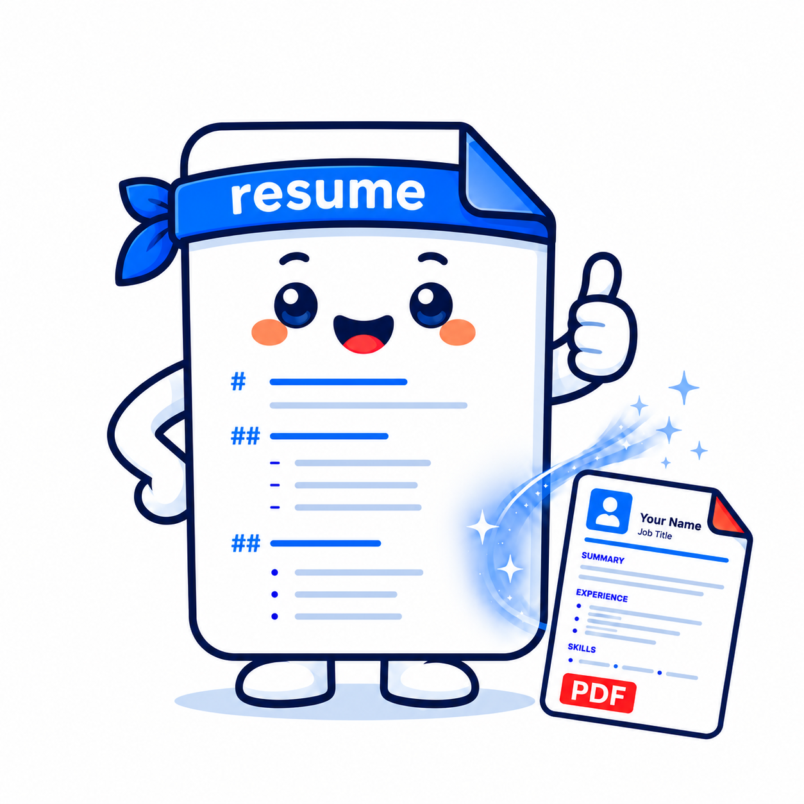
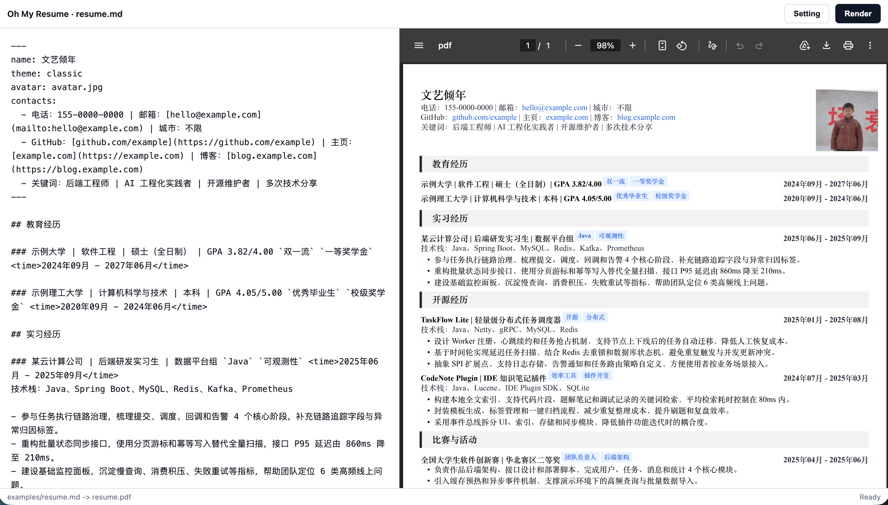
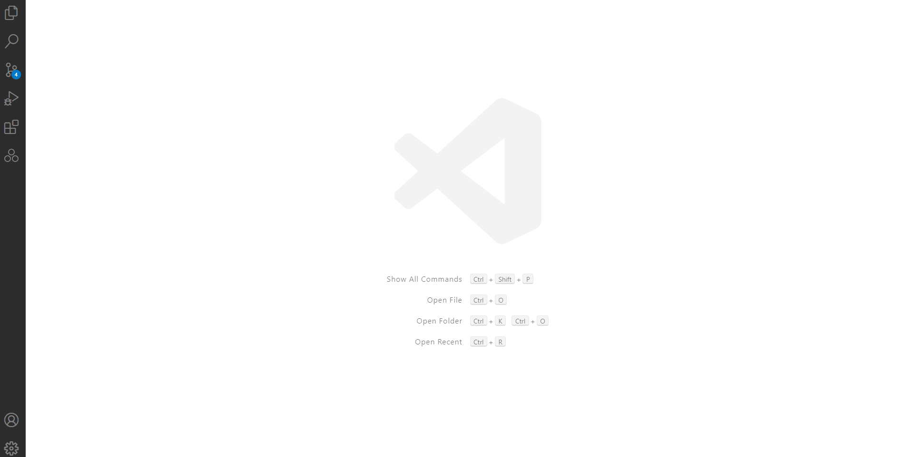

#   Oh My Resume

>  一个 Skill-first 的 Markdown 简历引擎——让职业经历像代码一样可读、可改、可追踪。

<p align="center">
  <a href="./README-EN.md"></a>&nbsp;
  <a href="./README.md"></a>&nbsp;
  <a href="LICENSE"></a>&nbsp;
  
</p>



⭐ [Star on GitHub](https://github.com/itxaiohanglover/oh-my-resume) ·
🚀 [Quick start](#快速开始) ·
📝 [Markdown Format](#markdown-格式)

---
一份真正有价值的简历，不是一张一次生成的 PDF。它是一份持续演进的职业记录，承载着个人经历、判断、选择与成长。

长期维护一份简历，需要三个核心能力：

- **上下文（Context）** —— 理解经历背后的价值。
  一个项目不只是技术栈的罗列，而是围绕问题、决策、挑战与成果展开的完整叙事。

- **迭代（Iteration）** —— 在持续优化中不断完善。
  优秀的简历并非一次完成，而是在反馈、修改与重构中逐渐形成。

- **掌控（Ownership）** —— 保持对职业数据的自主权。
  经历不应被限制在某个平台或模板中，而应始终保持可读、可改、可追踪、可复用。

Oh My Resume 围绕这三个核心理念构建：

**Context（理解经历） · Iteration（持续演进） · Ownership（自主掌控）**

在此基础上，**Agent 作为智能协作者**，参与简历构建的全过程，从内容组织、表达优化到格式生成，帮助将个人经历转化为高质量的职业叙事。


<p align="center">
  <em> Windows 下的工作流演示</em><br/>
  
</p>
---

## 为什么选择 Oh My Resume？

这个领域已有很多成熟产品，它们解决的问题不同。Oh My Resume 不试图复刻一个在线简历网站，而是选择另一条路线：**本地、自由、可编程、可被 Agent 深度协作。**

|          | [超级简历](https://www.wondercv.com/) | [老鱼简历](https://www.laoyujianli.com/) | [OneResume](https://github.com/virantha/one_resume) | LaTeX 模板 | **Oh My Resume** |
| :------: | ------------------------------------- | ---------------------------------------- | --------------------------------------------------- | :------------: | ---------------- |
| 核心定位 | 在线简历制作 | 在线简历制作 | 源码驱动简历生成 | 文档排版系统 | **Markdown 简历工程系统** |
| 内容源 | 平台数据 | 平台表单 | YAML 数据 | TeX 源码 | **Markdown 文件** |
| 内容编辑 | 可视化编辑 | 表单填写 | 数据配置 | 手动编写 | **Markdown + Agent 协作** |
| 生成流程 | 编辑 → 导出 | 编辑 → 导出 | 数据 → 模板 → PDF | TeX → PDF | **Markdown → Skill → XeLaTeX → PDF** |
| 版本管理 | 平台保存 | 平台保存 | 文件管理 | Git 可选 | **Git 原生支持** |
| 内容迭代 | 面向单次求职 | 面向快速修改 | 面向模板复用 | 面向排版优化 | **面向长期维护** |
| 样式控制 | 模板选择 | 模板配置 | 模板修改 | TeX 定制 | **JSON 配置驱动** |
| 数据归属 | 平台管理 | 平台管理 | 本地文件 | 本地文件 | **本地文件，可自由 Fork** |
| AI 能力 | 内容生成 | 文案优化 | 无原生 AI | 无 | **Agent 理解上下文并协助优化** |

##  快速开始

将本仓库安装为 Codex 或 Claude Code Skill：

```text
oh-my-resume/
  SKILL.md
  agents/openai.yaml
  assets/oh-my-resume/
```

如果你的工具需要重启 Agent，安装后重启一次。

###  Agent工作流

Oh My Resume 不是一个在线编辑器，它让 Agent 直接参与简历构建流程：

```
Use $oh-my-resume to create my resume PDF from resume.md.
```

Agent 会自动完成：

- 检查 Node.js、XeLaTeX、latexmk 环境；
- 读取 Markdown 简历内容；
- 根据配置生成对应样式；
- 渲染 PDF；
- 输出生成路径和构建信息。

调试模式：

```
Use $oh-my-resume to debug resume.md.
```

可以启动本地预览环境，快速调整内容和样式。

### Windows 首次使用

Windows 用户第一次生成 PDF 前，建议先准备本地 TeX 环境：

```bat
cd assets\oh-my-resume
install.bat
```

`install.bat` 会调用 `scripts\install.ps1`，刷新当前进程可见的 TeX 路径，保存 `OMR_TEX_PATH` 供后续终端使用，并执行 `node scripts\cli.js doctor`。脚本会优先复用已安装的 MiKTeX 或 TeX Live。

PowerShell / CI 可以直接运行：

```powershell
powershell -ExecutionPolicy Bypass -File scripts\install.ps1 -PersistUserEnv -VerifyPdf
```
---
## Markdown 格式

Oh My Resume 使用 Markdown 作为唯一事实源。

示例：

```md
### 项目名称`标签` <right>2025年01月 - 2025年08月</right>

- 项目描述
  - 技术细节
    - 量化结果
```

支持：

- `##` 表示简历模块
- `###` 表示经历条目
- `` `标签` `` 渲染Tag
- 自定义标签渲染文字对齐方式
- `-`多级列表自动映射
- `**重点**` 渲染粗体强调
- `[文本](链接)` 会保留为可点击链接
---
##  配置系统

所有视觉参数均通过`omr.config.json`控制。

包括：字体、页边距、行间距、主题颜色、图片尺寸等

示例：

```json
{
  "theme": {
    "colors": {
      "omrTagBg": "232,241,255",
      "omrTagText": "37,99,235",
      "omrSectionBg": "242,242,242"
    },
    "lengths": {
      "omrPageMarginLeft": "8mm",
      "omrPhotoWidth": "2.35cm",
      "omrPhotoHeight": "2.75cm",
      "omrHeaderNameGap": "0.41em",
      "omrSectionAfter": "0.54em"
    },
    "fonts": {
      "omrBodyFont": "TeX Gyre Termes",
      "omrCJKMainFont": "Kaiti SC"
    },
    "sizes": {
      "omrBodyFontSize": "11.2pt",
      "omrBodyLineHeight": "14.5pt",
      "omrSectionFontSize": "12.1pt",
      "omrEntryFontSize": "10.5pt"
    }
  }
}
```

如果需要完全自定义主题，可以在初始化后复制并编辑 `themes/classic.tex`。

### 配置优先级

Oh My Resume 会优先读取当前工作目录的本地配置：

1. 命令行指定 `--config path/to/config.json`

2. 当前目录 `omr.config.json`

3. Skill 默认配置

> 因此 Skill 更新不会覆盖你的当前简历样式。只要 `omr.config.json` 留在简历目录下，它就会优先覆盖内置推荐值。

### 本地样式模板

可以把常用样式保存到当前目录的 `omr.styles/`：

```text
omr.styles/
  current-comfort.json
  compact.json
  interview.json
```

Debug 页面的「样式设置 -> 模板」只读取当前目录的本地模板。如果没有 `omr.styles/*.json`，下拉框会显示为空状态。你也可以在「配置路径」里填写任意相对路径，例如：

```text
omr.styles/current-comfort.json
```

也可以点击「打开文件夹」选择包含 JSON 配置的文件夹，页面会读取其中的配置并应用。应用模板只会合并 `theme` 和 `markdown` 配置，不会修改 Markdown 正文、输入路径或输出路径。

---

##  环境要求

Skill 会自动检查：

-  Node.js 18+
-  XeLaTeX
-  latexmk

HTML 快速预览不依赖 TeX。`html-pdf` / 「HTML 导出 PDF」需要本机安装 Google Chrome、Microsoft Edge 或 Chromium；自动检测失败时可设置：

```bash
export OMR_HTML_PDF_BROWSER="/Applications/Google Chrome.app/Contents/MacOS/Google Chrome"
```

###   macOS

```bash
brew install --cask mactex-no-gui
```

###   Windows

- 安装 [MiKTeX Basic](https://miktex.org/download)，或安装 [TeX Live](https://tug.org/texlive/)
- 安装 [Strawberry Perl](https://strawberryperl.com/)
- 运行 `assets\oh-my-resume\install.bat`

###   Ubuntu/Debian

```bash
sudo apt-get install latexmk texlive-xetex texlive-lang-chinese
```

---
##  开源协议

本项目采用 [MIT License](LICENSE) 开源许可证。

---

<p align="center">
  <sub>Made with  by the open-source community</sub>
</p>
